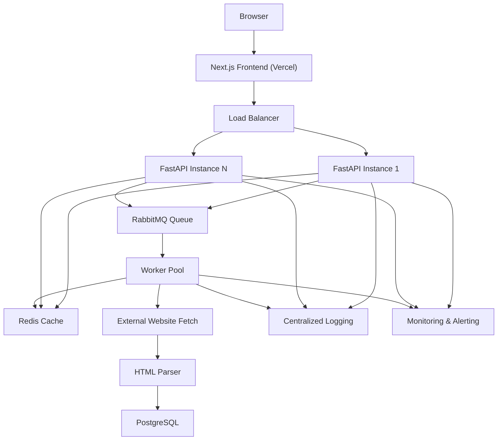

# Architecture

This document describes a production-grade target architecture for Page Pulse that can support roughly 10,000 audits per day, bursts of 500 concurrent users, and a customer-facing SLA.

Important distinction:

- Current implementation: single Next.js frontend, single FastAPI API, in-memory cache, in-process rate limiting, and direct request/response auditing.
- Proposed production architecture in this document: horizontally scalable API tier, shared Redis cache, queue-backed workers, persistent PostgreSQL storage, and formal observability.

## System Overview

Page Pulse is a URL-auditing platform that accepts a public webpage URL, fetches the page safely, parses its HTML, extracts a small set of SEO and accessibility signals, and returns a structured JSON report for frontend presentation.

At higher scale, the main operational challenge is not raw request volume alone. It is the variability of upstream websites:

- slow or unreliable third-party responses
- redirects
- intermittent DNS failures
- inconsistent HTML quality
- bursty user demand

The production architecture therefore separates synchronous user traffic from external fetch execution wherever practical, adds shared caching, and introduces dedicated worker capacity for controlled outbound concurrency.

## High-Level Architecture

The proposed deployment is a multi-tier system:

1. Browser users interact with a statically hosted Next.js frontend.
2. Requests are routed through a load balancer to multiple FastAPI API instances.
3. API instances validate the URL, perform authentication/rate limiting if applicable, and check Redis for a recent cached audit.
4. Cache hits return immediately.
5. Cache misses are written to a queue for controlled execution by worker processes.
6. Workers fetch the external website, parse the HTML, write audit results to PostgreSQL, and populate Redis.
7. The API returns the result either synchronously for fast jobs or via a polling-ready response pattern if the job remains in progress.

## Components

| Component | Role | Current Implementation | Proposed Production Role |
|---|---|---|---|
| Browser | User interface consumer | Yes | Same role; renders forms, states, and results |
| Next.js Frontend | UI delivery and API integration | Yes, deployed on Vercel | Same, with edge caching and static asset delivery |
| Load Balancer | Route incoming API traffic | Implicit via hosting platform | Explicit traffic distribution across FastAPI instances |
| Multiple FastAPI Instances | API tier | Single instance today | Horizontally scaled stateless instances |
| Redis Cache | Shared hot-result cache | Not currently shared; current cache is in-memory per instance | Shared cache for audit results, rate-limit counters, and short-lived job state |
| Queue (RabbitMQ or equivalent) | Decouple inbound traffic from external fetch work | Not present today | Durable job dispatch, retries, and backpressure control |
| Worker Processes | Execute outbound fetch + parse work | API performs work inline today | Dedicated background workers for controlled concurrency |
| PostgreSQL | Persistent audit storage and metadata | Not present today | Durable audit history, analytics, operational traceability |
| Logging | Operational diagnostics | Structured application logs exist today | Centralized structured logs with retention and search |
| Monitoring | Runtime visibility and alerting | Limited today | Metrics, dashboards, alerting, and SLO tracking |

### Browser

The browser is responsible for:

- capturing the URL input
- presenting loading, success, empty, and error states
- rendering cached or freshly computed results

The browser should remain unaware of internal queueing and infrastructure details.

### Next.js Frontend

The frontend remains primarily presentation-focused:

- validate basic input presence
- submit audit requests to the backend
- render typed responses
- show a stable product experience on mobile and desktop

In production, Next.js should continue to be deployed independently so frontend rollouts do not require backend redeployments.

### Load Balancer

The load balancer terminates HTTPS and distributes requests across FastAPI instances. It also improves resilience by:

- removing a single API node from rotation when unhealthy
- smoothing burst traffic
- supporting zero-downtime deployments

### Multiple FastAPI Instances

FastAPI instances should be stateless and interchangeable. Their responsibilities:

- request validation
- SSRF and URL safety checks
- request ID creation
- structured logging
- cache lookup
- enqueueing on cache miss
- returning consistent JSON responses

No instance should hold business-critical state in memory.

### Redis Cache

Redis provides shared low-latency state for:

- audit result caching by normalized URL
- rate-limiting counters
- short-lived job status
- response deduplication for repeated requests on the same URL

This replaces reliance on per-instance in-memory caches when scaling across multiple API replicas.

### Queue (RabbitMQ or Equivalent)

The queue absorbs burst traffic and protects the API tier from long-lived fetch tasks. It provides:

- buffering during spikes
- retry semantics
- visibility into backlog depth
- failure isolation between API nodes and worker nodes

RabbitMQ is a strong fit because the workload is task-oriented and benefits from explicit acknowledgements and dead-letter routing.

### Worker Processes

Workers handle the expensive part of the system:

- controlled outbound HTTP requests
- redirect handling
- HTML size enforcement
- parser execution
- persistence
- cache population

This allows concurrency policies to be tuned independently of user-facing request handling.

### PostgreSQL

PostgreSQL stores durable audit records and metadata such as:

- normalized URL
- fetch timestamp
- response status
- extracted fields
- execution outcome
- retry history

Even if the product initially returns results immediately without exposing history to users, PostgreSQL is useful for support, debugging, and trend analysis.

### Logging

Structured logs should include:

- timestamp
- request ID
- client IP
- normalized URL
- cache hit or miss
- queue job ID
- upstream response status
- fetch latency
- parser outcome
- final API response code

### Monitoring

Monitoring should combine metrics, logs, and alerting to support an SLA. The system should surface:

- request latency
- queue lag
- worker throughput
- cache hit ratio
- API error rates
- outbound fetch failures

## Request Flow

Complete lifecycle:

```text
Browser
  ->
Frontend
  ->
API
  ->
Cache
  ->
Queue
  ->
Workers
  ->
Website Fetch
  ->
HTML Parser
  ->
Database
  ->
JSON Response
```

Detailed flow:

1. The browser submits a URL from the Next.js frontend.
2. The frontend calls the FastAPI audit endpoint over HTTPS.
3. The load balancer routes the request to any healthy FastAPI instance.
4. The API normalizes and validates the URL, applies SSRF checks, and assigns a request ID.
5. The API checks Redis for a recent audit result using the normalized URL as the cache key.
6. If a cached result exists, the API returns it immediately.
7. If no cache entry exists, the API publishes a job to the queue.
8. A worker consumes the job, enforces outbound concurrency controls, and fetches the website.
9. The worker parses HTML, extracts the audit fields, and writes the result to PostgreSQL.
10. The worker stores the result in Redis for short-term reuse.
11. The API returns the completed JSON response directly for synchronous flows, or returns a job-tracking response pattern for longer-running workflows if the product later evolves in that direction.

## Queueing Strategy

### Asynchronous Workers

External website fetches are the least predictable step in the system. Queueing them:

- reduces p95 and p99 API latency under load
- prevents API workers from being tied up by slow upstream sites
- allows worker fleet scaling independent of API fleet scaling

### Retries

Retries should be selective and bounded.

Suggested policy:

- retry transient network failures
- retry worker interruption or infrastructure resets
- do not retry clearly invalid URLs or blocked SSRF targets
- use exponential backoff with jitter

### Dead-Letter Queues

Jobs that exceed retry limits should be sent to a dead-letter queue for later inspection. This prevents toxic jobs from cycling indefinitely and provides visibility into recurring failure patterns.

### Scalability

Queue-based scaling supports:

- more API instances for inbound traffic
- more workers for outbound fetch capacity
- independent tuning of CPU-bound and IO-bound workloads

That separation is especially important when bursts of 500 concurrent users arrive but many request the same or similarly slow targets.

## State Management

### What Is Stateless

The following components should be stateless:

- load balancer
- Next.js frontend deployment
- FastAPI API instances
- worker compute instances, aside from in-memory execution state

Statelessness enables rapid replacement, autoscaling, and rolling deployments.

### What Is Cached

Cached state should include:

- recent audit results by normalized URL
- short-lived job status
- shared rate-limit counters
- optional deduplication keys for in-flight audits

This state belongs in Redis because it is ephemeral and performance-sensitive.

### What Is Stored Permanently

Durable state should include:

- completed audit records
- failure outcomes worth analysis
- operational metadata
- optional user/account ownership if the product later adds authentication

This state belongs in PostgreSQL.

## Horizontal Scaling

### Load Balancing

Inbound requests should be distributed across multiple API replicas. Health checks must remove degraded instances automatically.

### Autoscaling

Autoscaling policies should consider:

- API CPU and latency
- queue depth
- worker throughput
- memory pressure

API and worker groups should scale independently.

### Stateless API

The API tier should not rely on local memory for correctness. Instance-local caches are acceptable only as a micro-optimization, never as the source of truth.

## ASCII Architecture Diagram

```text
                           +----------------------+
                           |      Browser         |
                           +----------+-----------+
                                      |
                                      v
                           +----------------------+
                           |   Next.js Frontend   |
                           |       (Vercel)       |
                           +----------+-----------+
                                      |
                                      v
                           +----------------------+
                           |    Load Balancer     |
                           +----------+-----------+
                                      |
                 +--------------------+--------------------+
                 |                                         |
                 v                                         v
      +----------------------+                 +----------------------+
      |   FastAPI Instance   |                 |   FastAPI Instance   |
      +----------+-----------+                 +----------+-----------+
                 |                                         |
                 +--------------------+--------------------+
                                      |
                    +-----------------+-----------------+
                    |                                   |
                    v                                   v
          +--------------------+              +--------------------+
          |     Redis Cache    |              |    RabbitMQ Queue  |
          +--------------------+              +---------+----------+
                                                         |
                                      +------------------+------------------+
                                      |                                     |
                                      v                                     v
                           +----------------------+             +----------------------+
                           |      Worker 1        |             |      Worker N        |
                           +----------+-----------+             +----------+-----------+
                                      |                                    |
                                      v                                    v
                           +----------------------+             +----------------------+
                           |  External Websites   |             |   HTML Parser        |
                           +----------+-----------+             +----------+-----------+
                                      \                                    /
                                       \                                  /
                                        v                                v
                                         +------------------------------+
                                         |         PostgreSQL           |
                                         +------------------------------+
```

## Mermaid Architecture Diagram



## Summary

The current Page Pulse implementation is appropriate for the assignment and small-scale production traffic. For a customer-facing SLA with bursty concurrency, the recommended evolution is:

- keep the frontend simple and independently deployable
- keep the API stateless
- move shared cache state into Redis
- introduce a durable queue and worker fleet
- add PostgreSQL for persistence and supportability
- formalize observability and scaling policies

That architecture reduces tail latency, isolates third-party website instability, and provides a more credible path to meeting uptime and response-time expectations.
